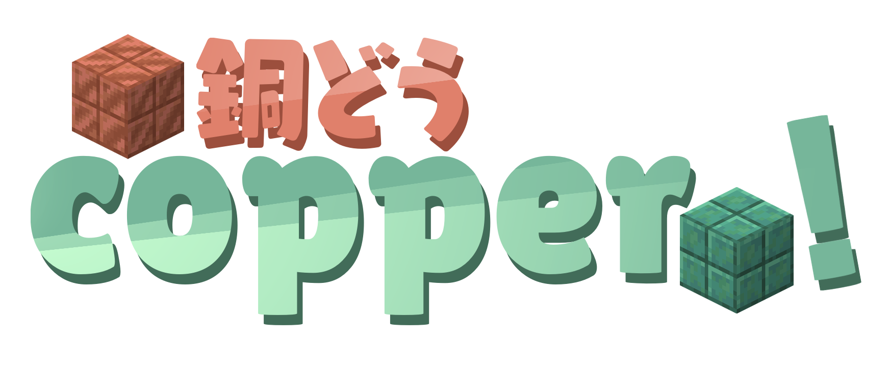

# copper-rs - Rust plugin bindings for Endstone

> [!IMPORTANT]
> This is new and isn't very feature-full or very stable.
>
> I'm open to contributions, so if you'd like, you can write your own stuff

> [!NOTE]
> This was AI-assisted to a degree and isn't very up to my quality standards. As the project matures, the AI parts of code goes away, and it will be. Please don't use this project to portray the rest of mine!

You can find an example plugin [here](https://github.com/niko-at-chalupa/my_copper_plugin)